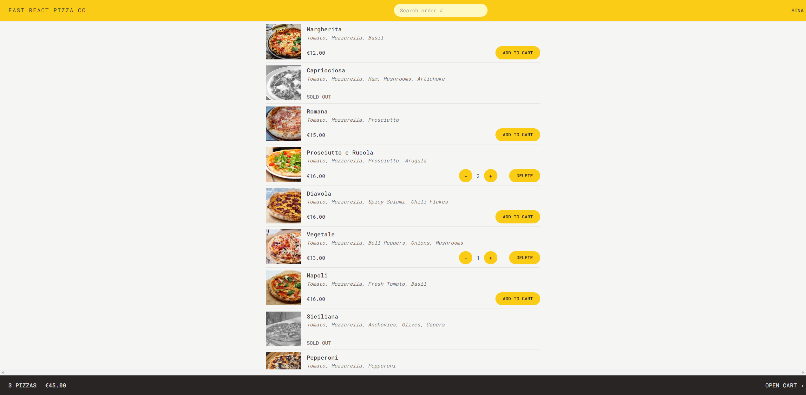

This is a project that is taught by [Jonas Schmedtmann](https://github.com/jonasschmedtmann) in his awesome [Course](https://www.udemy.com/course/the-ultimate-react-course/?couponCode=ST13MT40224)

in this project, I learned:

- how to use **react-router** and it's **custom hooks**
- how to use **redux-toolkit**
- how to use **tailwind**
- how to write and use **custom hooks**
- how to **conditionally render components**
